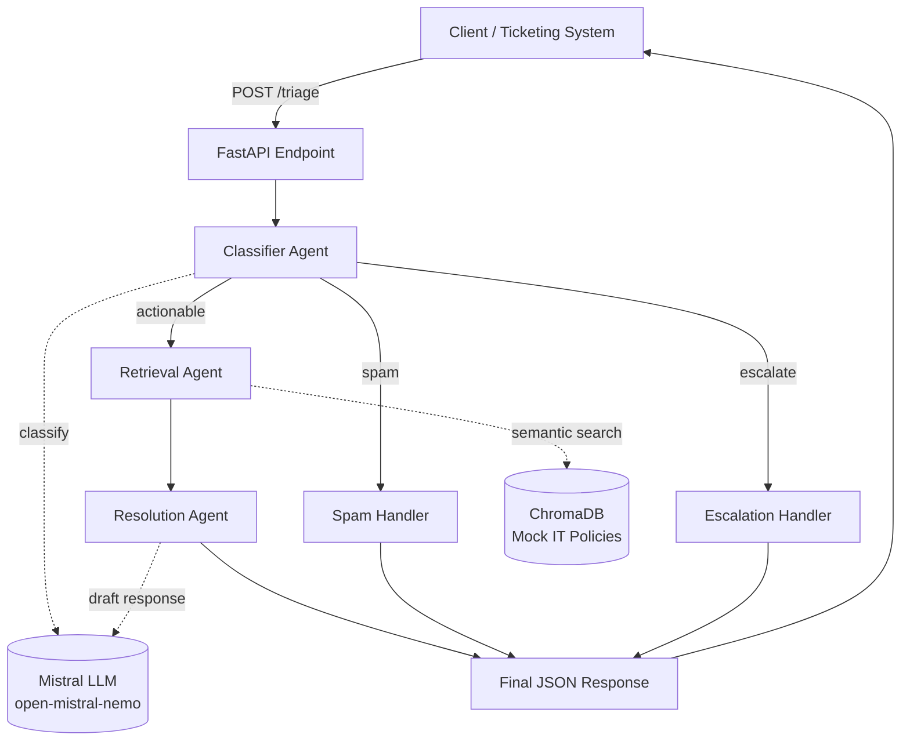

# 🎫 Autonomous IT Incident Triage Engine

[](https://github.com/Ankita1-a/IT-TRIAGE-ENGINE/actions/workflows/ci.yml)

An AI agent system that ingests JSON IT support tickets, classifies them, retrieves relevant internal policy context via RAG, and drafts a resolution or escalates to a human — built with FastAPI, LangGraph, ChromaDB, and Mistral.

## Overview

Every IT helpdesk deals with the same three buckets of tickets: routine issues with a known fix, noise that shouldn't have been filed at all, and genuinely serious problems that need a human immediately. Most of that triage work is repetitive and policy-driven — which makes it a good fit for an agentic pipeline rather than a human reading every single ticket first.

This system takes a raw ticket, runs it through three cooperating agents, and returns a structured decision:

- **Classifier Agent** — routes the ticket as `actionable`, `spam`, or `escalate`
- **Retrieval Agent** — for actionable tickets, searches a vector store of internal IT policies for the most relevant guidance
- **Resolution Agent** — drafts a response grounded in that retrieved policy text, rather than letting the LLM improvise a fix from general knowledge

## Business Value

- **Faster resolution** — routine tickets (password resets, VPN issues, printer connectivity) get a drafted, policy-grounded response in seconds instead of waiting in a human queue.
- **Reduced noise for human agents** — spam and non-IT requests are filtered out automatically, so support staff only see tickets that actually need attention.
- **Consistent, auditable policy application** — because resolutions are grounded in retrieved internal documents (RAG) rather than free-form LLM generation, answers reflect actual company policy, and every classification carries a stated reason for auditing.
- **Safer escalation by default** — the classifier defaults ambiguous or unrecognized cases to `escalate` rather than risking an incorrect auto-resolution, so uncertainty fails safe toward human review.

## Architecture



The graph is a `StateGraph` compiled with LangGraph: a single entry point (`classify`) fans out via conditional edges into three branches, two of which terminate immediately (`spam`, `escalate`) and one of which chains into retrieval + resolution before terminating.

## Tech Stack

| Component            | Technology                          |
|-----------------------|--------------------------------------|
| API framework          | FastAPI + Uvicorn                    |
| Agent orchestration    | LangGraph (`StateGraph`)             |
| LLM                    | Mistral (`open-mistral-nemo`)        |
| Vector store            | ChromaDB (local, persisted to disk)  |
| Containerization        | Docker + Docker Compose              |
| CI/CD                  | GitHub Actions                       |
| Testing                | pytest                               |

## Project Structure

```
IT_TRIAGE_ENGINE/
├── app/
│   ├── main.py              # FastAPI app: POST /triage, GET /health
│   ├── core/
│   │   ├── config.py         # Shared constants (Chroma path, collection name)
│   │   └── llm.py            # get_llm() — ChatMistralAI factory
│   ├── db/
│   │   └── init_chroma.py    # Builds the mock IT policy vector store
│   └── graph/
│       ├── state.py          # TicketInput (Pydantic), TriageState (TypedDict)
│       ├── nodes.py          # Classifier / Retrieval / Resolution agents
│       ├── edges.py          # Conditional routing logic
│       └── graph.py          # Compiles nodes + edges into the StateGraph
├── smoke_test.py             # Manual diagnostic script (real API calls) — not part of pytest
├── test_classifier.py        # Manual live classifier check — not part of pytest
├── run_graph.py              # Manual end-to-end graph run — not part of pytest
├── test_main.py              # Automated pytest suite (mocked — no live API needed)
├── pytest.ini                # Scopes pytest to test_main.py only
├── requirements.txt          # Production dependencies
├── requirements-dev.txt      # + pytest, httpx for testing
├── Dockerfile
├── docker-compose.yml
├── .dockerignore
├── .gitignore
├── .env.example              # Template — copy to .env and fill in your key
└── .github/workflows/ci.yml  # Test + Docker build pipeline
```

## Getting Started (Local)

**Prerequisites:** Python 3.11, a Mistral API key ([console.mistral.ai](https://console.mistral.ai)).

```bash
# 1. Clone and enter the project
git clone https://github.com/Ankita1-a/IT-TRIAGE-ENGINE.git
cd IT-TRIAGE-ENGINE

# 2. Create and activate a virtual environment
python -m venv .venv
source .venv/bin/activate      # Windows: .venv\Scripts\activate

# 3. Install dependencies
pip install -r requirements.txt

# 4. Configure your API key
cp env.example .env
# then edit .env and set MISTRAL_API_KEY=<your real key>

# 5. Build the local mock policy vector store (one-time; needs internet
#    the first time to download the embedding model)
python -m app.db.init_chroma

# 6. Run the API
uvicorn app.main:app --reload
```

Then in another terminal:

```bash
curl -X POST http://127.0.0.1:8000/triage \
  -H "Content-Type: application/json" \
  -d '{"ticket_id": "T-1", "subject": "VPN not connecting", "description": "Cannot connect since this morning"}'
```

## Running with Docker

```bash
cp .env.example .env
# edit .env and set your real MISTRAL_API_KEY

docker compose up --build
```

This builds a production image (multi-stage, non-root user, the mock policy store baked in at build time), starts the container, and persists the vector store in a named volume across restarts. Verify it's healthy:

```bash
curl http://localhost:8000/health
# {"status": "ok"}
```

Then send a ticket the same way as the local `curl` example above, against `http://localhost:8000/triage`.

To stop: `docker compose down` (add `-v` only if you also want to wipe the persisted vector store).

## Running the Test Suite

```bash
pip install -r requirements-dev.txt
pytest -v
```

This runs the automated suite in `test_main.py` — 9 tests covering the FastAPI request/response contract and the LangGraph conditional routing logic, all mocked at the LLM boundary so the suite runs instantly with **no API key and no network access required**.

`smoke_test.py`, `test_classifier.py`, and `run_graph.py` are separate manual diagnostic scripts that make real Mistral API calls — useful for hands-on verification during development, but deliberately excluded from automated test collection (see `pytest.ini`) since they shouldn't run unattended in CI.

## CI/CD

Every push to `main` triggers `.github/workflows/ci.yml`, which:

1. **Runs the test suite** — installs `requirements-dev.txt`, runs `pytest -v`.
2. **Verifies the Docker image builds** — only runs if tests pass; builds the full production image from a clean checkout to confirm it compiles with no cached shortcuts.

## API Reference

### `POST /triage`

**Request:**
```json
{
  "ticket_id": "T-1",
  "subject": "VPN not connecting",
  "description": "Cannot connect since this morning",
  "requester_email": null,
  "priority": null
}
```

**Response:**
```json
{
  "ticket": { "...": "echoed input" },
  "category": "actionable",
  "classification_reason": "...",
  "retrieved_context": ["..."],
  "final_response": "..."
}
```

`requester_email` and `priority` are optional.

### `GET /health`

Returns `{"status": "ok"}` — used by the Docker healthcheck and safe for load-balancer liveness probes.